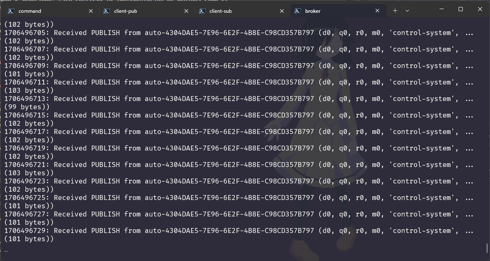

# Emulador de dispositivo sensor

Esta herramienta de terminal simula la funcionalidad de un dispositivo sensor.  
Genera y transmite parámetros ficticios mediante publicaciones MQTT.



## Recomendación importante
≧◠‿◠≦

La transmisión de información, sin importar el medio empleado, debe asegurar  
la privacidad y seguridad. Esto conlleva la implementación de medidas como el  
cifrado de datos y la autenticación de clientes o usuarios.

Es importante destacar que este proyecto ha sido creado únicamente con  
fines de prueba y experimentación. Por lo tanto, se recomienda no utilizarlo en  
un entorno de producción sin realizar las adecuaciones de seguridad necesarias.


## Configuración de desarrollo
≧◠‿◠≦

### Requisitos previos

* Conocimientos básicos de terminal y línea de comandos
* Tener instalado [Python](https://www.python.org/) en tu sistema que incluye [PIP](https://pypi.org/project/pip/)
* Tener instalado [Mosquitto](https://https://mosquitto.org//) en tu sistema
* Configurar un Broker para administrar los procesos MQTT
   * Crea un archivo de configuración mosquitto.conf en un directorio de tu  
   elección con estos parametros.

      ```ini
      listener 1883
      protocol  mqtt

      listener 8080
      protocol websockets

      allow_anonymous true
      ```

   * Desde la terminal navega al directorio de instalación de mosquitto y luego  
   ejecuta el comando del broker usando la ruta del archivo mosquitto.conf

      ```bash
      ./mosquitto.exe -c <ruta_al_archivo_de_configuracion> -v
      ```

### Proceso de implementación

#### Clonar repositorio

```
git clone https://github.com/miniscandal/encode-decode-message-jwt.git
cd .\encode-decode-message-jwt\
```

#### Habilitar entorno virtual

```bash
python -m venv .\venv
.\venv\Scripts\activate
```

#### Instalar módulos requeridos

```bash
pip install -r requirements.txt`
```

#### Recursos esenciales

* Para realizar publicaciones a los temas especificados, necesitarás iniciar una  
terminal en el directorio de instalación de mosquitto.

   * Lista de comandos para publicar


   ``` bash
   .\mosquitto_pub -t "device/1" -m '{"procedure_code_request": 0}'
   .\mosquitto_pub -t "device/1" -m '{"procedure_code_request": 3}'
   .\mosquitto_pub -t "device/1" -m '{"procedure_code_request": 4}'
   .\mosquitto_pub -t "device/1" -m '{"procedure_code_request": 5, "device_id": 2}'
   .\mosquitto_pub -t "device/1" -m '{"procedure_code_request": 6}'
   ```


### Lista de comandos para el script

``` bash
python .\src\main.py -h
python .\src\main.py -i 1 -s 2
```


## Documentación 
≧◠‿◠≦


### Tecnologías utilizadas


### Referencias

* [Python](https://www.python.org/)
* [Mosquitto](https://https://mosquitto.org//) 


## Reflexiones y aprendizajes

Este proyecto es el segundo que he realizado con un enfoque en la comunicación  
en tiempo real. A diferencia de mi primer proyecto, que fue un esfuerzo de equipo  
durante mis estudios universitarios, este fue desarrollado de manera individual  
para enriquecer mi portafolio personal.

Por alguna razón, tuve la oportunidad de reflexionar sobre el proyecto realizado  
durante mi carrera universitaria. Me di cuenta de algo importante, en aquel entonces  
lideraba el desarrollo del proyecto pero no necesariamente al equipo con el que  
colaboraba para llevarlo a cabo. Mi participación con el equipo no fue tan efectiva  
como me hubiera gustado. Sin embargo, esta experiencia ha sido valiosa ya que me  
ha permitido mejorar mis actitudes y habilidades interpersonales.

Las lecciones que he adquirido han transformado mi enfoque hacia el trabajo en  
equipo y liderazgo. Ahora implementaría habilidades esenciales como la comunicación  
asertiva y buscaría activamente el apoyo de los integrantes del equipo.

He comprendido la importancia de valorar e incentivar las habilidades y conocimientos  
únicos de cada integrante del equipo. Con confianza en sus habilidades y capacidades  
individuales, delegaría tareas, aceptaría e implementaría sus ideas proporcionando  
el apoyo necesario para guiarlas hacia un camino prometedor.

Estas mejoras propiciarán un avance más sólido en los proyectos de equipo, reforzarán  
la solidaridad, las conexiones sociales y nutrirán la amistad, y estos serán los  
pasos que tomaré en el futuro, basados en el conocimiento que adquiriré.

Desde una perspectiva técnica, este sistema es una entidad integrada y cohesiva.  
Aunque el proyecto se ejecutó con éxito en su momento, mi crecimiento y evolución  
en términos de conocimientos y habilidades son notables.

Actualmente, tengo la habilidad y el conocimiento para diseñar un sistema que  
hace una distinción clara entre la interfaz de usuario y los componentes de  
automatización e implementación de persistencia. Esta diferenciación facilita el  
desarrollo independiente de cada componente, lo que a su vez mejora la flexibilidad  
ademas de la escalabilidad del proyecto en general.

He adquirido una perspectiva renovada que me capacita para identificar oportunidades  
de mejora en la arquitectura del sistema, las reglas de negocio y los patrones  
empleados. La eficiencia en el desarrollo podría potenciarse a través de una lectura  
meticulosa y una comprensión más profunda de la documentación relevante, una  
estrategia que antes no aplicaba de manera tan efectiva.

Estos avances me proporcionarán la oportunidad de optimizar el sistema de una manera  
más efectiva, potenciando su eficiencia y rendimiento. En esencia, me encuentro  
en una posición privilegiada para elevar este proyecto a nuevas alturas de éxito.

## Créditos

≧◠‿◠≦

#### Recursos de código abierto

* [Mosquitto](https://https://mosquitto.org//):
  Broker de mensajes que implementa el protocolo MQTT.

Agradecemos a los autores de estas bibliotecas por su trabajo y contribución  
para la comunidad de software libre.


## Licencia

≧◠‿◠≦

Este proyecto está bajo la licencia MIT. Consulta el archivo LICENSE para más detalles.
